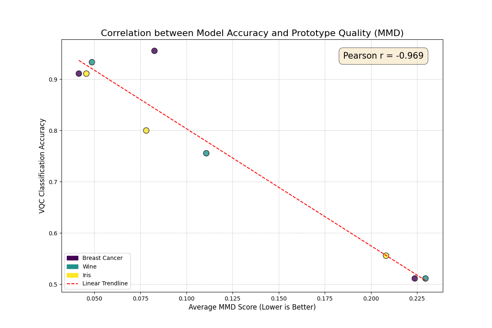
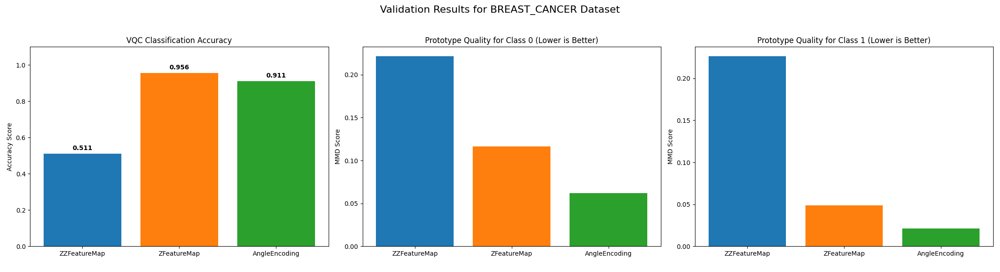
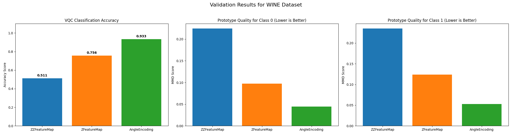
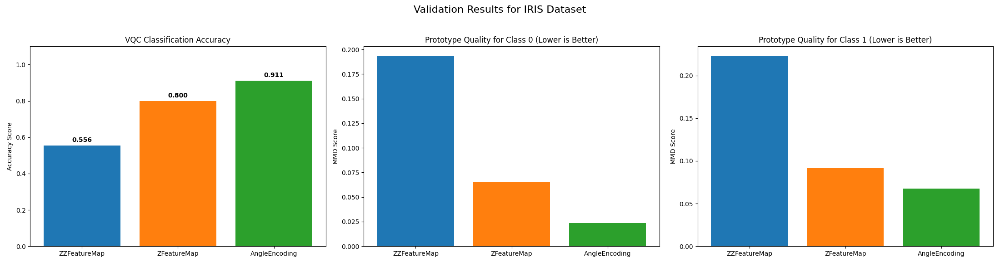

# Evaluating Quantum Feature Maps using MMD-based Prototypes

This repository presents a comprehensive study on evaluating and understanding quantum feature maps in Quantum Machine Learning (QML). We introduce an interpretable, prototype-based method leveraging Maximum Mean Discrepancy (MMD) to quantitatively assess the quality of data embeddings produced by different quantum circuits, providing a powerful tool for model selection and explainability.

**Authors:** Marco Garlini, Alberto Tagliaferro, Simone Reale

---

## 1. The Problem: The QML "Black Box"

Quantum Machine Learning holds immense promise, but many of its models, particularly Variational Quantum Classifiers (VQCs), operate as "black boxes." The performance of a VQC is critically dependent on the choice of a **quantum feature map**—the circuit responsible for encoding classical data into the high-dimensional quantum state space.

This choice is often heuristic, leaving practitioners with critical unanswered questions:
- How can we determine if a feature map is creating a useful, class-separable data representation?
- Is there a way to compare different encoding strategies without undertaking expensive, full-scale model training and hyperparameter tuning?
- Can we make the inner workings of these quantum models more transparent and interpretable?

This project aims to answer these questions by developing a low-cost, quantitative, and interpretable evaluation framework.

## 2. Our Approach: Prototypes as a Measure of Quality

Our framework is built on a simple yet powerful hypothesis:
> A feature map is effective if it allows for the selection of a small set of **prototypes** that accurately represent the entire dataset's distribution in the quantum feature space.

A **prototype** is a real data point from the training set that serves as the "best possible example" of its class. By identifying these key representatives, we can gauge the quality of the data's structure in the quantum Hilbert space.

### Maximum Mean Discrepancy (MMD)

To find these optimal prototypes, we employ the **Maximum Mean Discrepancy (MMD)**. MMD is a statistical metric that measures the distance between the probability distributions of two sets of samples. In our case, it calculates the "distance" between the distribution of a candidate prototype set ($Z$) and the full dataset of a given class ($X$).

The MMD is computed using the kernel trick, leveraging a **quantum kernel** $k(x_i, x_j) = |\langle\psi(x_i)|\psi(x_j)\rangle|^2$, which measures the similarity of two data points in the feature space. Our goal is to find the prototype set $Z$ that **minimizes the MMD score**. A lower MMD signifies a higher-quality, more representative set of prototypes.

---

## 3. Experimental Design

To validate our hypothesis, we designed a rigorous, controlled experiment.

### Datasets
We used three well-known classification datasets from `scikit-learn`:
1.  **Iris Dataset**
2.  **Wine Dataset**
3.  **Breast Cancer Dataset**

To ensure a fair and controlled comparison, all datasets were pre-processed:
-   **Binary Classification:** Transformed into two-class problems.
-   **Dimensionality Reduction:** Reduced to **4 features** using Principal Component Analysis (PCA). This standardizes the problem complexity for the quantum models.
-   **Size Normalization:** Downsampled to **150 instances** using stratified sampling to maintain class balance.

### Quantum Feature Maps
We compared three distinct feature maps to test different encoding strategies:
1.  **AngleEncoding:** A simple, non-entangling baseline where each feature is encoded into the rotation angle of a single qubit.
2.  **ZFeatureMap:** A non-entangling map from the Qiskit library.
3.  **ZZFeatureMap:** A complex map that introduces **entanglement** between qubits, theoretically capable of capturing more complex correlations.

### Evaluation Protocol
For each of the 9 combinations (3 datasets × 3 feature maps), we followed this protocol:
1.  **Compute Quantum Kernel:** Calculate the full kernel matrix for the training data.
2.  **Find Prototypes:** Use our optimized greedy algorithm to find the 3 best prototypes for each class, minimizing the per-class MMD score.
3.  **Train Classifier:** Train a Variational Quantum Classifier (VQC) on the same data.
4.  **Measure & Compare:** Record the final per-class MMD scores and the VQC's classification accuracy on the test set.

---

## 4. Results and Analysis

The experimental results provide strong, consistent evidence supporting our hypothesis.

### Key Finding: MMD is a Powerful Predictor of Model Performance

Our primary finding is the **strong negative correlation (Pearson r = -0.95)** between the average MMD score and the final VQC accuracy. This statistically significant result confirms that our MMD-based metric is an excellent proxy for predicting the performance of a quantum model. Feature maps that yield better prototypes (lower MMD) consistently lead to more accurate classifiers.


*Figure 1: Strong negative correlation between prototype quality (Average MMD Score) and final model accuracy across all 9 experiments.*

### Per-Dataset Results

The pattern holds true across all individual datasets.

| Dataset         | Best Feature Map (by Accuracy) | Best Feature Map (by MMD) | Worst Feature Map (Both Metrics) |
|-----------------|--------------------------------|---------------------------|----------------------------------|
| **Breast Cancer** | `ZFeatureMap` (95.6%)          | `AngleEncoding`           | `ZZFeatureMap` (57.8%)           |
| **Wine**        | `AngleEncoding` (93.3%)        | `AngleEncoding`           | `ZZFeatureMap` (51.1%)           |
| **Iris**        | `AngleEncoding` (91.1%)        | `AngleEncoding`           | `ZZFeatureMap` (55.6%)           |


*Figure 2: Results for the Breast Cancer dataset. Note the strong correspondence between low MMD (center, right) and high accuracy (left).*


*Figure 3: Results for the Wine dataset, showing a near-perfect correlation.*


*Figure 4: Results for the Iris dataset, confirming the established trend.*

### Discussion: The "Sufficiently Good" Representation

An interesting nuance appeared in the Breast Cancer results: `AngleEncoding` had the best MMD scores, but `ZFeatureMap` achieved a marginally higher accuracy. This suggests that while MMD is a powerful predictor, a "threshold of quality" may exist. Once a feature map creates a "sufficiently good" data representation (i.e., MMD is low enough), the model can achieve high accuracy, and other factors, like the specific interplay between the feature map and the variational ansatz, may determine the final marginal gains.

### The Surprising Ineffectiveness of Entanglement

A key insight from this study is the **consistent failure of the entangling `ZZFeatureMap`**. For these structured, tabular datasets, adding entanglement proved detrimental, consistently producing the highest MMD scores and lowest accuracies. This suggests that entanglement is not a panacea and can obscure, rather than enhance, the underlying data structure, possibly by inducing trainability issues like barren plateaus. Our MMD metric successfully identified this weakness without the need for a full, costly training run.

---

## 5. Conclusion

This project successfully establishes MMD-based prototype selection as a **robust, quantitative, and interpretable framework** for evaluating quantum feature maps.

**Key Contributions:**
1.  **A Predictive Metric:** We validated MMD as a statistically significant proxy for VQC performance, enabling low-cost model selection.
2.  **Guidance on Encoding Strategy:** We provided evidence that for tabular data, simpler, non-entangling feature maps can be superior to more complex ones.
3.  **Enhanced Interpretability:** Our method opens the QML "black box" by identifying the most representative data points, offering a tangible insight into the model's learned representation.

This work provides a valuable tool for researchers and practitioners to design, diagnose, and understand quantum machine learning models more effectively.

---

## 6. How to Run This Project

### Dependencies
The project requires Python 3.8+ and the following libraries:
- `pandas`
- `numpy`
- `matplotlib`
- `scikit-learn`
- `qiskit`
- `qiskit-machine-learning`
- `alive-progress`
- `scipy`

You can install them via pip:
```bash
pip install pandas numpy matplotlib scikit-learn qiskit qiskit-machine-learning alive-progress scipy
